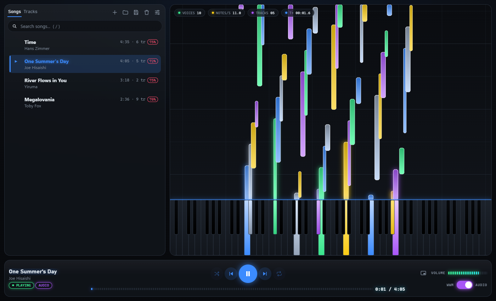
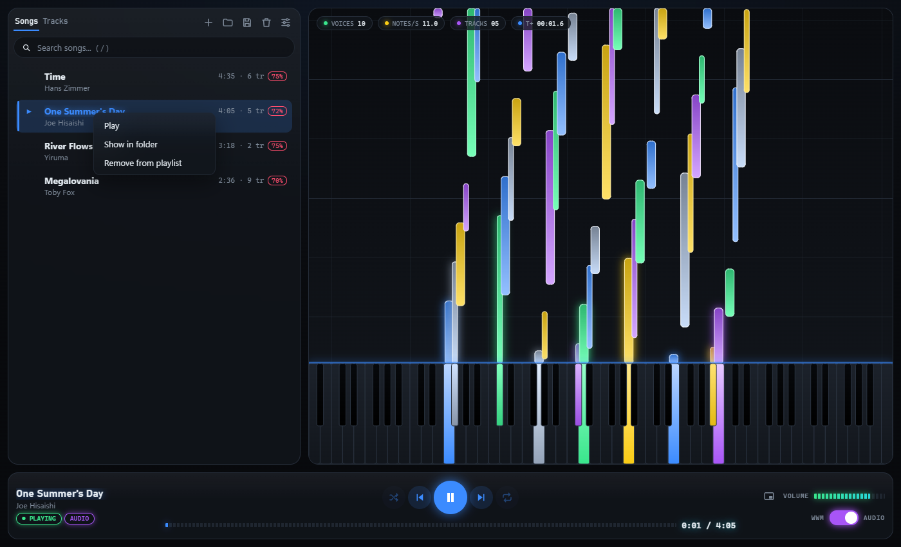
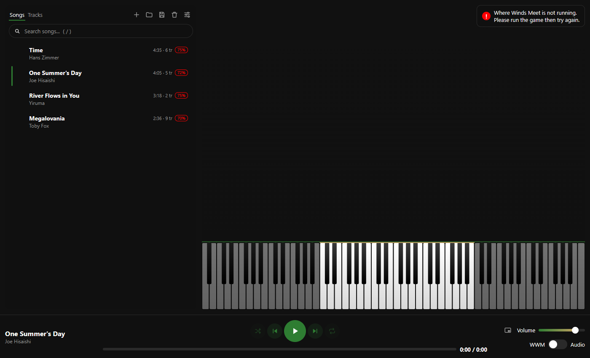
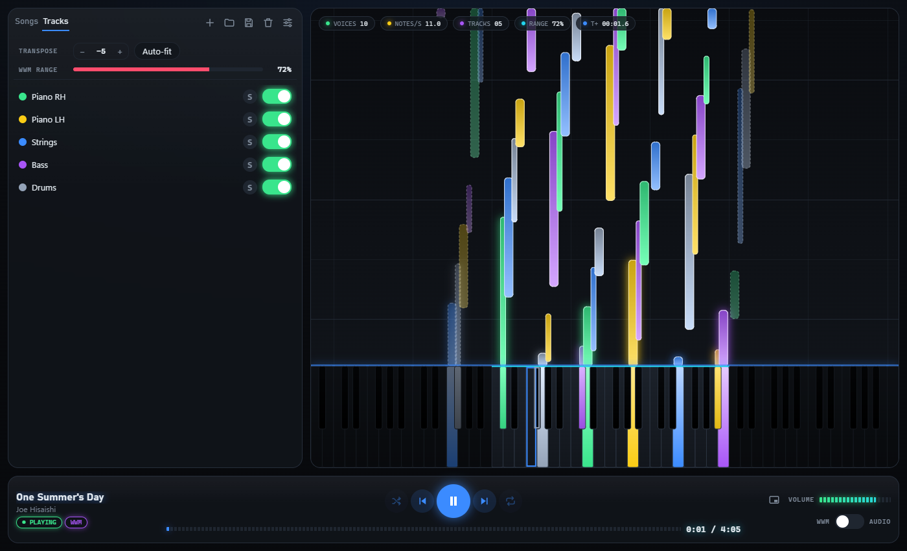
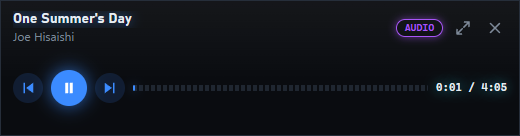
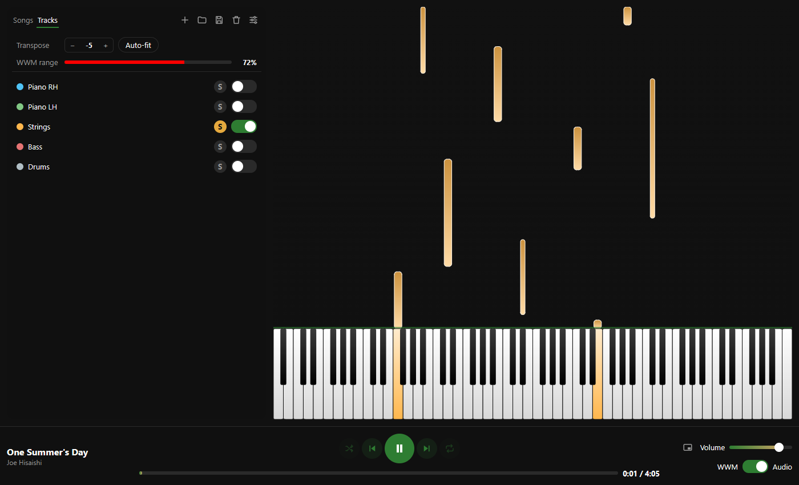
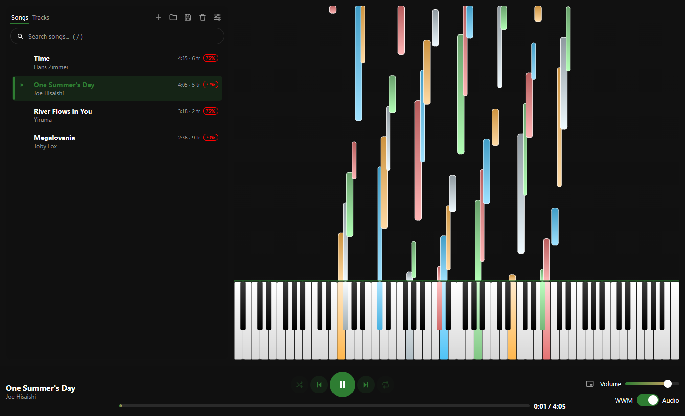
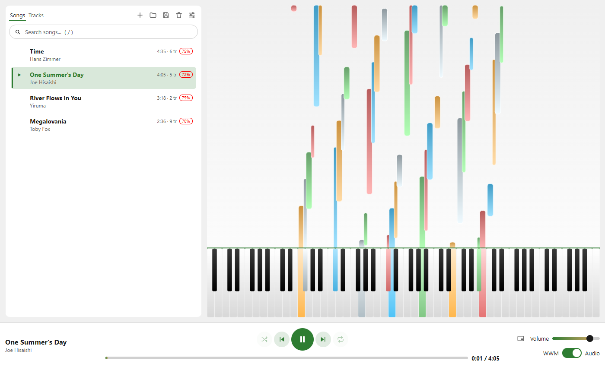
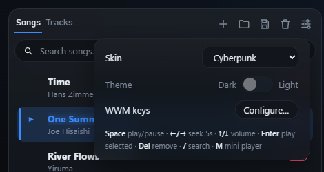
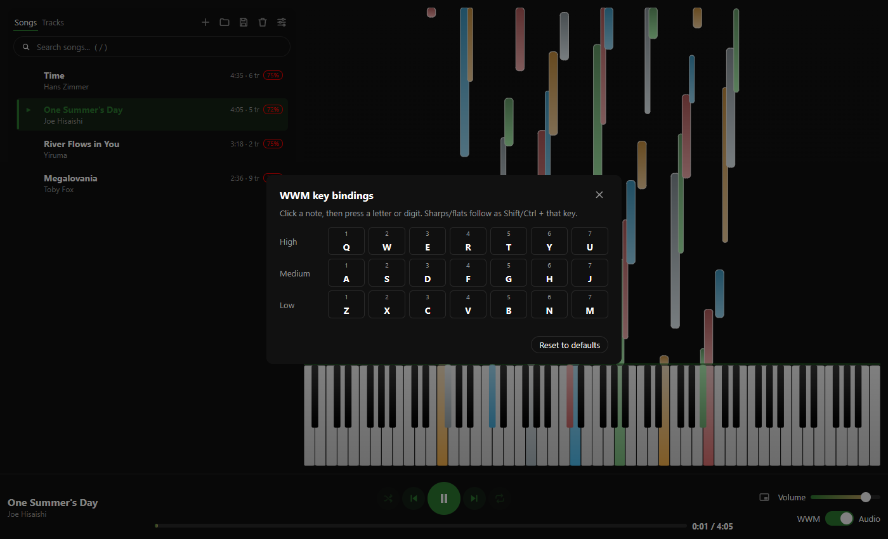

# WWM MIDI Player

A Windows desktop MIDI player with a web-based interface (HTML/CSS/JS in a
native WebView2 window via [pywebview](https://pywebview.flowrl.com/), on a
Python backend). It plays MIDI files through a bundled SoundFont like a
normal player, but its real purpose is **WWM mode**: it simulates keypresses
into the game window for *Where Winds Meet*, mapped to the in-game Konghou
instrument's key bindings, so your character performs the song live as it
plays.



## Features

### Playlist

Drop MIDI files or whole folders onto the window (or press **+**), search by
title or artist, shuffle and repeat, and save/load playlists as `.m3u`
files. Drag songs to reorder them; right-click a song to play it, show it in
Explorer, or remove it. Each song shows its length, instrument-track count,
and how much of it fits WWM's playable range. Titles and artists are parsed
from filenames in `Artist - Title.mid` form.



### Two playback modes

- **Audio mode** plays through a bundled SoundFont, like a normal MIDI
  player — useful for previewing a track before performing it in-game.
- **WWM mode** posts synthetic keypresses into the *Where Winds Meet*
  window (matched by title), mapped to the game's Konghou key bindings, so
  your character performs the song live. This requires the game to already
  be running — if it isn't, the app tells you instead of failing silently:

  

Switch between the two anytime with the toggle in the now-playing bar or
the F8 hotkey.

### Made for WWM

The game's instrument covers only MIDI notes 48–83 (three octaves); notes
outside that range get shifted by whole octaves to fit.

- **Playable range view** — in WWM mode the visualizer dims the keys the
  game can't play, fades out-of-range notes, and outlines the key each one
  actually lands on.
- **Per-song transpose** — shift a song up or down by semitones, or press
  **Auto-fit** to pick the shift that keeps the most notes in range. It's
  remembered per song and applies in both modes, so Audio mode previews
  exactly what WWM mode will play.
- **Mini player** — a compact always-on-top controller (**M**, or the button
  next to Volume) to keep over the game instead of the full window.




### Falling-note piano visualizer

An 88-key keyboard with notes falling toward it in sync with playback,
colored per instrument **track** rather than MIDI channel — many files
route every instrument through the same channel, so coloring by channel
alone would make everything look identical.

### Per-track mute & solo

Switch to the **Tracks** tab next to the playlist to see every instrument
in the loaded file, each with a color swatch matching the visualizer, a
mute toggle, and a solo button. Changes apply live during playback, in
both Audio and WWM mode — mute the drums, solo the melody to learn it, etc.



### Skins

Pick a look in Settings: **Default** (dark or light) or **Cyberpunk** — a
dark-glass, neon sci-fi HUD with live readouts and LED-style meters.




### Remappable WWM key bindings

Settings → **WWM keys → Configure…** opens a per-note grid so you can
rebind any scale degree/register to a different key, matching your own
in-game control scheme instead of the default Konghou layout.




### Seek

Click or drag anywhere on the progress bar to jump to that point in the
track; hovering shows the time under the cursor, and the visualizer follows
while you drag.

### Keyboard shortcuts

F8–F11 are global — they work even while the game window has focus, so you
don't need to alt-tab back to the player mid-song. The rest work in the
player window.

| Shortcut | Action |
|----------|--------|
| F8 | Switch Audio/WWM mode |
| F9 / F11 | Previous / next track |
| F10 or Space | Play/Pause |
| ← / → | Seek 5 seconds |
| ↑ / ↓ | Volume |
| Enter / Delete | Play / remove the selected song |
| / | Search |
| M | Mini player |
| Ctrl+O / Ctrl+S | Add files / save playlist |

### Settings persistence

Volume, Audio/WWM mode, skin and theme, your playlist/selection, and
per-song transposes are restored the next time you launch the app.

## Requirements

- Windows 10 or 11 (the app uses `pywin32` for game-window messaging and the
  Microsoft Edge WebView2 runtime for its interface — included with Windows
  11 and current Windows 10)
- Python 3.11–3.13, if running from source

## Installation

**Prebuilt installer:** grab the latest installer from the
[Releases](https://github.com/KrapFey/wwm-midi-player/releases) page
and run it.

**From source:** this project uses [uv](https://docs.astral.sh/uv/) for
environment/dependency management.

```powershell
# Install uv (skip if you already have it)
powershell -ExecutionPolicy ByPass -c "irm https://astral.sh/uv/install.ps1 | iex"

git clone https://github.com/KrapFey/wwm-midi-player.git
cd wwm-midi-player
uv venv --seed
.venv\Scripts\activate
uv pip install -e .
python src/web_app.py
```

## Usage

1. Drop MIDI files or folders onto the window (or press **+**, or open a
   saved `.m3u` playlist).
2. Double-click a song to play it.
3. Toggle **WWM / Audio** in the now-playing bar to choose whether playback
   simulates in-game keypresses (WWM mode requires *Where Winds Meet* to
   already be running) or plays through your speakers.
4. In the **Tracks** tab, mute or solo instruments and transpose the song
   into WWM's range.
5. **Settings → WWM keys** to remap which keys each note sends in WWM mode.

## Contributing

See [CONTRIBUTING.md](CONTRIBUTING.md) for development setup, coding
standards, and the pull request process. Please also read our
[Code of Conduct](CODE_OF_CONDUCT.md).

## Security

See [SECURITY.md](SECURITY.md) for how to report a vulnerability.

## License

[GPL-3.0-or-later](LICENSE)
